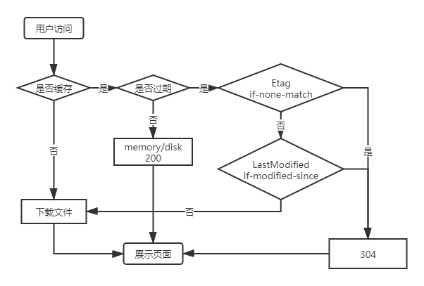

# koa-http-cache
使用koa搭建web服务器测试强缓存和协商缓存

### 强缓存

使用Expires + Cache-Control

未缓存情况下正常请求

已缓存情况下

1、直接输入URL点击回车，200 form disk cache

2、点击刷新按钮 html 重新下载，其他文件200 form memory cache

 pragma   > Cache-Control > Expires

### 协商缓存

Etag/If-None-Match

Last-Modifined/If-Modified-Since

Etag > Last-Modifined